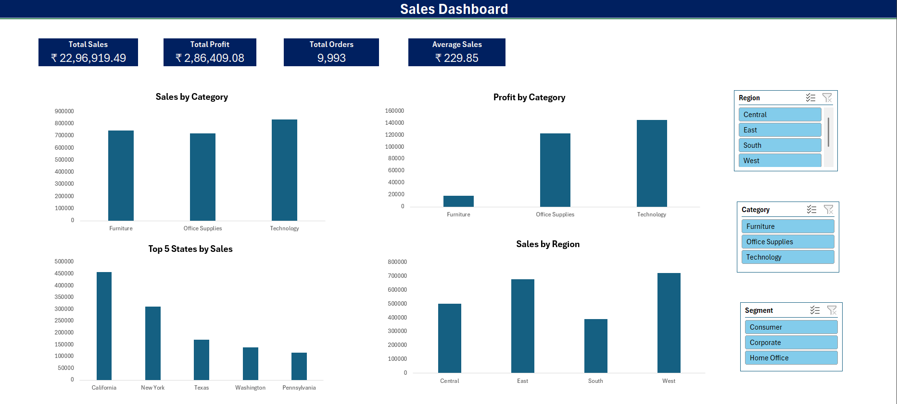

# Sales Dashboard - Data Analyst Project

## Project Overview
This project is a Sales Dashboard created to analyze sales performance and generate meaningful business insights using Excel and Power BI.

## Tools & Technologies
- Microsoft Excel
- Power BI
- Data Cleaning
- Data Analysis
- Data Visualization

## Dataset Details
The dataset contains:
- Order Information
- Customer Details
- Product Details
- Sales Data
- Profit Data

## Dashboard Preview

## Key Insights
- Analyzed overall sales and profit performance
- Identified top-performing states and categories
- Studied product-wise sales trends
- Created interactive dashboard visuals

## 📊 Dashboard KPIs

- Total Sales: ₹22,96,919.49
- Total Profit: ₹2,86,409.08
- Total Orders: 9,993
- Average Sales: ₹229.85

## Author
Sakshi Gupta

GitHub: https://github.com/sakshuuu2903
